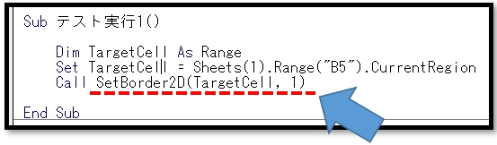

# VBA-SetBorder
- License: The MIT license

- Copyright (c) 2021 YujiFukami

- 開発テスト環境 Excel: Microsoft® Excel® 2019 32bit 

- 開発テスト環境 OS: Windows 10 Pro

実行環境など報告していただくと感謝感激雨霰。

# 説明
指定セル範囲を見やすいように罫線を設定する

基準列において、値が切り替わるところだけ水平線を太くしたりする。

線の種類は自由に選べることができる。

## 活用例
エクセルの表を報告書用などのために見やすくするのを自動化する。

# 使い方
実行サンプル「Sample_SetBorder.xlsm」の中は以下のようになっている。

サンプル実行前

「実行テスト1」ボタンを押す

「実行テスト2」ボタンを押す

2列目を基準に罫線を変更している。さらに罫線の種類が変わっている。

サンプルのプロシージャ中身

「実行テスト1」ボタンの中身

「実行テスト2」ボタンの中身

プロシージャ「SetBorder」の引数は以下の通り

TargetCell                  ・・・対象とするセルの範囲(Range型)

BaseCol                     ・・・基準の列（対象範囲セルの左から何番目か）(Long型)

[EdgeLineStyle]             ・・・外側罫線のスタイル    （デフォルトは実線）

[EdgeLineWeight]            ・・・外側罫線の太さ        （デフォルトは中太線）

[InsideHorizontalLineStyle] ・・・内側水平罫線のスタイル（デフォルトは点線）

[InsideHorizontalLineWeight]・・・内側水平罫線の太さ    （デフォルトは細線）

[InsideVerticalLineStyle]   ・・・内側垂直罫線のスタイル（デフォルトは実線）

[InsideVerticalLineWeight]  ・・・内側垂直罫線の太さ    （デフォルトは細線）

## 設定
実行サンプル「Sample_SetBorder.xlsm」の中の設定は以下の通り。

### 設定1（使用モジュール）

-  ModTest.bas
-  ModSetBorder.bas
-  ModEnums.bas

### 設定2（参照ライブラリ）
なし

